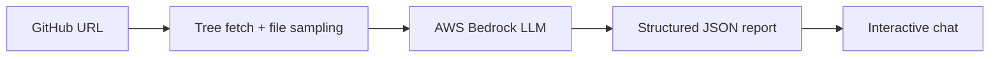

# Codebase Auditor

<p align="center">
  
  
  
</p>

AI-powered repository auditor for public GitHub projects.  
Paste a repo URL, get a structured health report with architecture mapping, MLOps issue detection, and an interactive follow-up chat.

## Live Demo

[codebase-auditor.vercel.app](https://codebase-auditor.vercel.app)

## What it does

Most AI repos are messy. This tool helps engineers quickly understand and clean up codebases they didn't write.

- Ingests any public GitHub repository
- Builds a high-level architecture map
- Detects common AI/MLOps issues by severity
- Produces a structured audit report with a health score
- Lets users ask follow-up questions about the findings
- Stores chat session memory across the conversation

## Example Audit Output

<p align="center">
  
  
</p>

## How it works


## Tech Stack

### Frontend
- Next.js 16
- TypeScript
- Tailwind CSS

### Backend
- FastAPI
- Python 3.12
- AWS Bedrock

### Infrastructure
- AWS Lambda
- API Gateway
- S3
- OpenTofu

## Project Structure
```bash
.
├── backend
├── frontend
├── opentofu
├── scripts
└── .env.example
```

## Architecture

Designed for a serverless deployment flow:

- Frontend on Vercel
- Backend on AWS Lambda
- API Gateway as HTTP entrypoint
- S3 for session memory
- OpenTofu for infrastructure management
